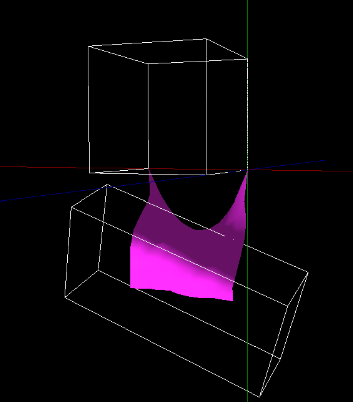
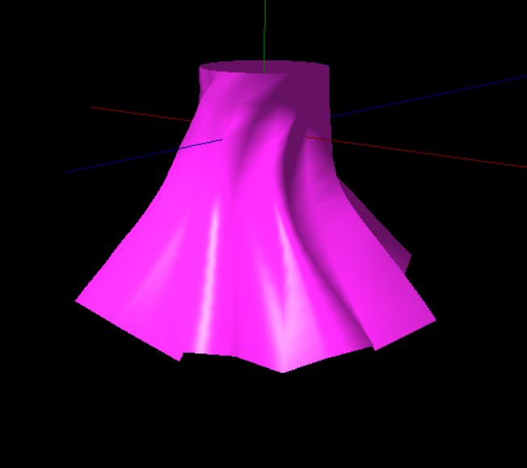
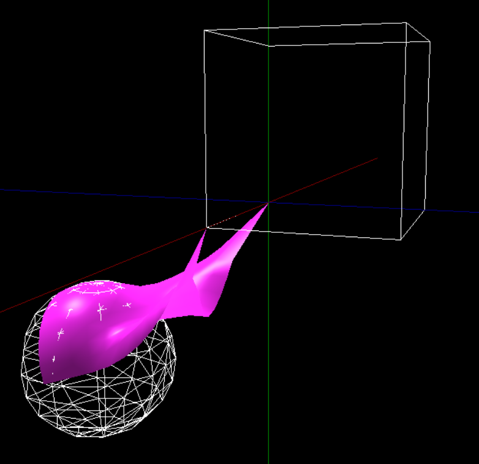
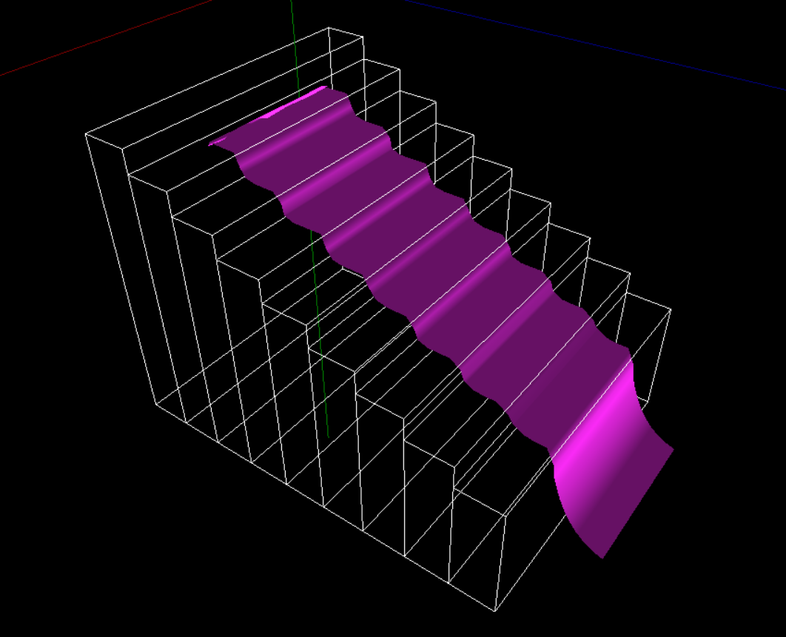
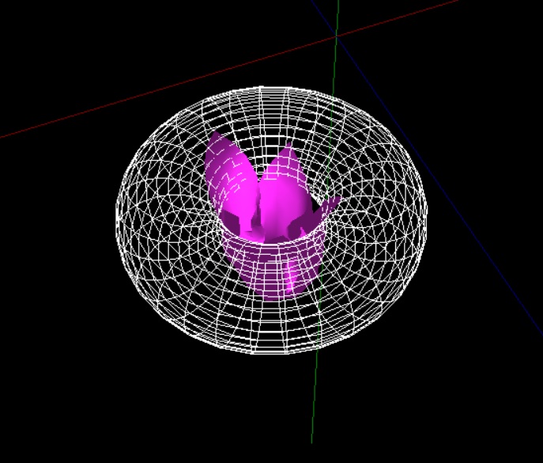

# Cloth simulation - master thesis project

## Project Background

This project forms the implementation part of a master's thesis for the "Computer Science and Information Systems" program, specializing in "CAD/CAM Systems Design" at the Faculty of Mechatronics, Warsaw University of Technology. The thesis topic is "Simulation of Materials and Clothes Based on Nonlinear Optimization Methods with Inequality Constraints".

The task focused on creating realistic simulations of materials and clothing, enhancing the realism and immersive quality of the game environment and characters. This feature is integral to "Kosmic Fried Chicken", contributing to its unique aesthetic and gameplay experience.

## Technologies

A range of technologies have been used in this project to facilitate the development of this simulation feature:

- **C#**: The primary programming language used for the development.
- **WPF**: Windows Presentation Foundation (WPF) was used to create the desktop application interface, providing a user-friendly and efficient means of interaction with the feature.
- **SharpDX**: A graphics library for .NET, used as a wrapper for DirectX11. This allowed for the efficient and high-performance rendering of the 3D models.
- **Matlab**: Used for the implementation of nonlinear optimization algorithms, aiding in the realistic simulation of materials and clothing.
- **MATLAB Compiler SDK**: This was employed to convert Matlab code to .NET assembly, integrating the optimization algorithms with the rest of the project.
- **FFmpeg**: This software suite was utilized for handling multimedia data. It was instrumental in saving the simulation as an .mp4 video file. This video file was later used in the final paper to showcase the results and formulate conclusions.

## Functionality & Application

The simulation feature designed for this project utilises nonlinear optimisation methods with inequality constraints, a sophisticated approach that yields realistic results. It helps to represent materials and clothing with impressive accuracy and detail.

This feature plays a pivotal role in enhancing the game's visual appeal and creating a more immersive gaming experience. The simulation capabilities contribute to the realistic depiction of characters and environments, thereby enriching the player's engagement with the game world.

## Sample Scenes & Effects

The following graphics present example scenes and effects that can be achieved using the material and clothing simulation feature implemented in this project.

## Usage & Contribution

Feel free to explore the repository. I encourage feedback and contributions to enhance the material and clothing simulation capabilities of the project.

## Contributing

Contributions from the community are welcome. If you're interested in contributing, please follow these steps:

1. Fork the repository
2. Create your feature branch: `git checkout -b feature/YourFeature`
3. Commit your changes: `git commit -am 'Add some feature'`
4. Push to the branch: `git push origin feature/YourFeature`
5. Submit a pull request

## License

This project is licensed under the [MIT License](LICENSE).
