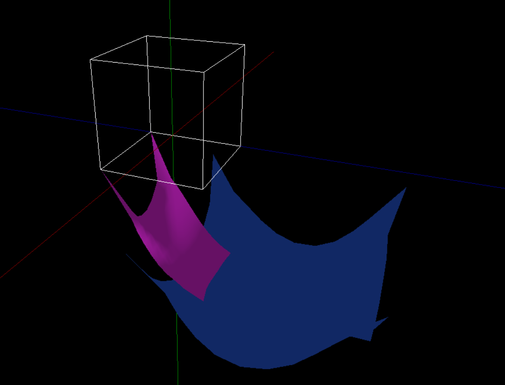

Projekt ten jest częścią implementacyjną pracy magisterskiej na kierunku "Informatyka i Systemy Informacyjne" specjalizacji "Projektowanie Systemów CAD/CAM" wydziału MiNI Politechniki Warszawskiej.
Temat pracy to "Symulacja materiałów i ubrań w oparciu o metody optymalizacji nieliniowej z ograniczeniami nierównościowymi".

Poniższe grafiki przedstawiają przykładowe sceny i efekty, które można uzyskać w aplikacji.

